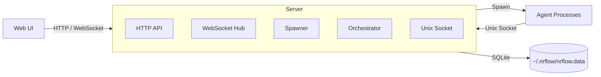

# nrflow

A self-hosted workflow orchestration system that spawns AI agents to implement tickets and project tasks. Agents run in isolated git worktrees, execute in configurable layer-based phases, and report back through real-time WebSocket updates — all managed from a web UI.

## Features

- **Multi-workflow support** — feature, bugfix, hotfix, docs, refactor workflows, all customizable via the web UI
- **Layer-based phase execution** — agents in the same layer run concurrently; layers execute sequentially
- **Multiple AI backends** — Claude CLI, Opencode, Codex
- **Real-time monitoring** — WebSocket-driven workflow visualization and agent output streaming
- **Interactive PTY sessions** — take control of a running agent directly from the browser
- **Ticket management** — dependencies, priorities, parent tickets, and execution chains
- **Project-scoped workflows** — run workflows at the project level without a ticket
- **Automatic context management** — low-context detection triggers save/resume with findings carry-over
- **Stall detection and auto-restart** — frozen agents are detected and relaunched automatically
- **Agent callbacks** — later-layer agents can re-trigger earlier layers for iterative refinement
- **Automatic merge conflict resolution** — spawns a resolver agent when worktree merge fails
- **Git worktree isolation** — each ticket workflow runs in its own worktree
- **Template variables and findings expansion** — agent prompts support `${VAR}` substitution and `#{FINDINGS:agent}` patterns
- **Low consumption mode** — swap to cheaper models globally with one toggle
- **Error tracking** — browse agent failures, timeouts, and workflow errors in the UI
- **Dark mode UI**

## Tech Stack

| Layer | Technologies |
|-------|-------------|
| **Backend** | Go 1.25, Cobra CLI, SQLite (modernc.org/sqlite), gorilla/websocket, golang-migrate, creack/pty |
| **Frontend** | React 19, TypeScript 5.9, TanStack Query, Zustand, Tailwind CSS v4, xterm.js, React Flow, CodeMirror 6, Zod |
| **Database** | SQLite (`~/.nrflow/nrflow.data`), auto-migrating schema |

## Quick Start

```bash
make build && make install
nrflow_server serve
# Open http://localhost:6587
```

To make the server accessible on the local network:

```bash
nrflow_server serve --host 0.0.0.0
```

## CLI Overview

nrflow ships two binaries:

| Binary | Purpose |
|--------|---------|
| `nrflow_server` | HTTP API + WebSocket + Unix socket server |
| `nrflow` | Agent CLI (used by spawned agents) + ticket/dependency management |

**Agent commands** (used by spawned agents via Unix socket):

| Command | Description |
|---------|-------------|
| `nrflow agent fail` | Report agent failure |
| `nrflow agent continue` | Signal continuation |
| `nrflow agent callback --level N` | Trigger callback to re-run an earlier layer |
| `nrflow findings add key:value` | Write findings to current session |
| `nrflow findings append key:value` | Append to existing finding |
| `nrflow findings get [agent-type] [key]` | Read own or cross-agent findings |

**Ticket management** (requires running server):

| Command | Description |
|---------|-------------|
| `nrflow tickets list` | List tickets (filterable by status, type, parent) |
| `nrflow tickets create --title "..."` | Create a ticket |
| `nrflow tickets update <id>` | Update ticket fields |
| `nrflow tickets close <id>` | Close a ticket |
| `nrflow deps add <ticket> <blocker>` | Add a dependency |
| `nrflow deps remove <ticket> <blocker>` | Remove a dependency |

See [agent_manual.md](agent_manual.md) for the full agent definition reference.

## Workflows

Workflows are stored in the database and fully customizable via the web UI. Example configurations:

| Workflow | Phases (by layer) | Use Case |
|----------|-------------------|----------|
| `feature` | L0: setup-analyzer &rarr; L1: test-writer &rarr; L2: implementor &rarr; L3: qa-verifier &rarr; L4: doc-updater | New features (full TDD) |
| `bugfix` | L0: setup-analyzer &rarr; L1: implementor &rarr; L2: qa-verifier | Bug fixes |
| `hotfix` | L0: implementor | Urgent fixes |
| `docs` | L0: setup-analyzer &rarr; L1: doc-updater | Documentation only |
| `refactor` | L0: setup-analyzer &rarr; L1: implementor &rarr; L2: qa-verifier | Code refactoring |

All agents in the same layer run concurrently. The next layer starts only after the current layer completes (at least one agent must pass). If a layer has multiple agents, the next layer must have exactly one agent (fan-in rule).

## Architecture



The server runs everything in-process: the orchestrator groups phases by layer, the spawner launches agent processes, and the WebSocket hub broadcasts real-time updates to connected clients. Agent definitions (prompts, models, timeouts) and workflow definitions are stored in the database and managed through the web UI.

## Build & Test

| Target | Description |
|--------|-------------|
| `make build` | Build both binaries (dev, includes UI) |
| `make build-release` | Optimized release build |
| `make install` | Install to `/usr/local/bin` (override with `PREFIX=...`) |
| `make test` | Run backend tests |
| `make test-ui` | Run frontend tests |
| `make test-pkg PKG=...` | Run tests for a single backend package |
| `make clean` | Remove build artifacts |
| `make tidy` | Tidy Go module dependencies |
| `make help` | Show all available targets |

## Configuration

| Variable | Default | Description |
|----------|---------|-------------|
| `NRFLOW_HOME` | `~/.nrflow` | Data directory (database, logs) |
| `NRFLOW_PROJECT` | — | Project identifier (discovered from env) |

Logs are written to `$NRFLOW_HOME/logs/be.log`.

## License

nrflow is source-available under the Business Source License 1.1 (`BUSL-1.1`).

You may use nrflow in production, including self-hosted internal/company
deployments, but you may not offer nrflow to third parties as a hosted or
managed service.

Commercial licenses are available: anderfredx@gmail.com

Each released version converts to Apache License 2.0 on the earlier of:

- April 4, 2030
- the fourth anniversary of that version's first public release

See [LICENSE](LICENSE) for the exact terms.
