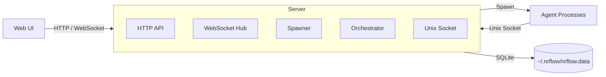

# nrflow

A self-hosted control plane for AI engineering workflows.

nrflow orchestrates coding agents across layered workflows, isolated git worktrees, and structured findings handoffs, with real-time monitoring and browser takeover when automation needs human control.

## Why nrflow

- **Repeatable engineering workflows** — define an implementation process once, then run it consistently across tickets and projects
- **Human supervision built in** — take over a live run, guide the agent directly, then resume orchestration without losing state
- **Self-hosted by design** — keep prompts, runtime state, execution, and repository access under your own control
- **Mixed-agent compatible** — run workflows across Claude CLI, Opencode, and Codex without changing the workflow model

## Core capabilities

### Orchestration
- Vendor-agnostic orchestration across Claude CLI, Opencode, and Codex
- Layered execution with same-layer parallelism and validated fan-in progression
- Ticket-scoped and project-scoped workflows
- Dependency-aware sequential ticket chains

### Handoffs and validation
- Structured findings handoffs between agents
- Verifier callbacks that re-run earlier layers with explicit instructions
- Prompt templates, findings expansion, and model controls

### Human control and recovery
- Browser takeover of live runs
- Interactive start, plan mode, and resume flows
- Low-context continuation, stall restart, manual restart, and retry from the failed layer

### Git and delivery
- Isolated git worktrees for ticket execution
- Automatic merge handling
- Conflict-resolver agent on failed merge
- Optional push after merge

### Observability
- Real-time workflow graph
- Logs, findings, final results, and error tracking

## How It Works

1. Pick a ticket-scoped or project-scoped workflow from the web UI.
2. nrflow starts agents by layer, running same-layer agents concurrently.
3. Agents write findings that downstream agents can consume in their prompts.
4. If a verifier finds a problem, it can callback an earlier layer and re-run the workflow from that point.
5. If automation gets stuck or needs direction, you can switch to interactive control in the browser.
6. On success, nrflow merges worktree changes, can invoke a conflict resolver, and reports the final workflow result.

## Tech Stack

| Layer | Technologies |
|-------|-------------|
| **Backend** | Go 1.25, Cobra CLI, SQLite (modernc.org/sqlite), gorilla/websocket, golang-migrate, creack/pty |
| **Frontend** | React 19, TypeScript 5.9, TanStack Query, Zustand, Tailwind CSS v4, xterm.js, React Flow, CodeMirror 6, Zod |
| **Database** | SQLite (`~/.nrflow/nrflow.data`), auto-migrating schema |

## Quick Start

The fastest way to try nrflow on macOS is via Homebrew.

### Install via Homebrew (macOS)

```bash
brew tap nrflow/tap
brew install nrflow
```

To upgrade:

```bash
brew update && brew upgrade nrflow
```

### Build from source

```bash
make build && make install
```

### Run

```bash
nrflow_server serve
# Open http://localhost:6587
```

To make the server accessible on the local network:

```bash
nrflow_server serve --host 0.0.0.0
```

## CLI Overview

nrflow ships two binaries:

| Binary | Purpose |
|--------|---------|
| `nrflow_server` | HTTP API + WebSocket + Unix socket server |
| `nrflow` | Agent CLI (used by spawned agents) + ticket/dependency management |

**Agent commands** (used by spawned agents via Unix socket):

| Command | Description |
|---------|-------------|
| `nrflow agent fail` | Report agent failure |
| `nrflow agent continue` | Signal continuation |
| `nrflow agent callback --level N` | Trigger callback to re-run an earlier layer |
| `nrflow findings add key:value` | Write findings to current session |
| `nrflow findings append key:value` | Append to existing finding |
| `nrflow findings get [agent-type] [key]` | Read own or cross-agent findings |

**Ticket management** (requires running server):

| Command | Description |
|---------|-------------|
| `nrflow tickets list` | List tickets (filterable by status, type, parent) |
| `nrflow tickets create --title "..."` | Create a ticket |
| `nrflow tickets update <id>` | Update ticket fields |
| `nrflow tickets close <id>` | Close a ticket |
| `nrflow deps add <ticket> <blocker>` | Add a dependency |
| `nrflow deps remove <ticket> <blocker>` | Remove a dependency |

See [agent_manual.md](agent_manual.md) for the full agent definition reference.

## Workflows

Workflows are stored in the database and edited through the web UI. A workflow is a sequence of agent layers with validation boundaries. Example configurations:

| Workflow | Phases (by layer) | Use Case |
|----------|-------------------|----------|
| `feature` | L0: setup-analyzer &rarr; L1: test-writer &rarr; L2: implementor &rarr; L3: qa-verifier &rarr; L4: doc-updater | New features (full TDD) |
| `bugfix` | L0: setup-analyzer &rarr; L1: implementor &rarr; L2: qa-verifier | Bug fixes |
| `hotfix` | L0: implementor | Urgent fixes |
| `docs` | L0: setup-analyzer &rarr; L1: doc-updater | Documentation only |
| `refactor` | L0: setup-analyzer &rarr; L1: implementor &rarr; L2: qa-verifier | Code refactoring |

All agents in the same layer run concurrently. The next layer starts only after the current layer completes (at least one agent must pass). If a layer has multiple agents, the next layer must have exactly one agent (fan-in rule).

## Architecture

At runtime, the server owns orchestration, process spawning, websocket updates, and persistent workflow state.



The server runs everything in-process: the orchestrator groups phases by layer, the spawner launches agent processes, and the WebSocket hub broadcasts real-time updates to connected clients. Agent definitions (prompts, models, timeouts) and workflow definitions are stored in the database and managed through the web UI.

## Build & Test

| Target | Description |
|--------|-------------|
| `make build` | Build both binaries (dev, includes UI) |
| `make build-release` | Optimized release build |
| `make install` | Install to `/usr/local/bin` (override with `PREFIX=...`) |
| `make test` | Run backend tests |
| `make test-ui` | Run frontend tests |
| `make test-pkg PKG=...` | Run tests for a single backend package |
| `make clean` | Remove build artifacts |
| `make tidy` | Tidy Go module dependencies |
| `make help` | Show all available targets |

## Configuration

| Variable | Default | Description |
|----------|---------|-------------|
| `NRFLOW_HOME` | `~/.nrflow` | Data directory (database, logs) |
| `NRFLOW_PROJECT` | — | Project identifier (discovered from env) |

Logs are written to `$NRFLOW_HOME/logs/be.log`.

## License

nrflow is source-available, self-hostable, and production-usable internally.

nrflow is released under the Business Source License 1.1 (`BUSL-1.1`).

You may use nrflow in production, including self-hosted internal/company
deployments, but you may not offer nrflow to third parties as a hosted or
managed service.

Commercial licenses are available: anderfredx@gmail.com

Each released version converts to Apache License 2.0 on the earlier of:

- April 4, 2030
- the fourth anniversary of that version's first public release

See [LICENSE](LICENSE) for the exact terms.
