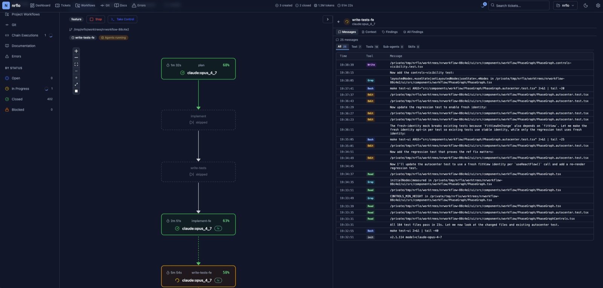
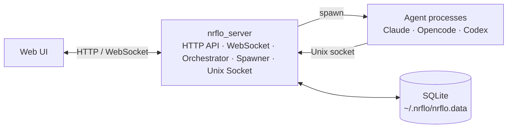

# NRFLO

A self-hosted control plane for AI engineering workflows.

NRFLO orchestrates coding agents across layered workflows, isolated git worktrees, and structured findings handoffs, with real-time monitoring and browser takeover when automation needs human control.

<p align="center">
  
</p>

<p align="center">
  <a href="https://nrflo.com/"><strong>nrflo.com</strong></a>
</p>

## Why NRFLO

- **Repeatable engineering workflows** — define an implementation process once, then run it consistently across tickets and projects
- **Human supervision built in** — take over a live run, guide the agent directly, then resume orchestration without losing state
- **Self-hosted by design** — keep prompts, runtime state, execution, and repository access under your own control
- **Mixed-agent compatible** — run workflows across Claude Code, Opencode, and Codex without changing the workflow model
- **Uses your existing CLI subscriptions. No API billing.** NRFLO drives Claude Code, Opencode, and Codex in two flavours — as non-interactive batch invocations for headless layered runs, or as PTY-attached interactive sessions you can take over live in the browser. Both flavours reuse each tool's local login, so runs go through your Claude Pro / Max, ChatGPT, or Opencode provider plan. Nothing new to pay for, no API keys to rotate, no per-token surprises.

## Core capabilities

### Orchestration
- Vendor-agnostic orchestration across Claude Code, Opencode, and Codex
- Layered execution with same-layer parallelism and sequential layer progression
- Ticket-scoped and project-scoped workflows
- Dependency-aware sequential ticket chains
- Endless loop mode for project-scoped workflows that re-spawn after completion
- Per-agent low-consumption toggle that swaps to a cheaper model on the fly

### Scheduled execution
- Cron-driven scheduler dispatches workflows or workflow chains on a schedule
- Per-task fan-out across multiple workflows with run-row tracking
- Ad-hoc "run now" trigger from the UI; full run history retained per task

### Handoffs and validation
- Structured findings handoffs between agents
- Verifier callbacks that re-run earlier layers with explicit instructions
- Prompt templates, findings expansion, and model controls

### Human control and recovery
- Browser takeover of live runs (kill-and-resume, or live viewer-attach in interactive CLI mode)
- Interactive start, plan mode, and resume flows
- PTY-backed interactive CLI mode for Claude/Codex/Opencode with live keystroke capture
- Idle/nudge loop that prompts unresponsive interactive agents before failing them
- Low-context continuation, stall restart, manual restart, and retry from the failed layer

### Git and delivery
- Isolated git worktrees for ticket execution
- Automatic merge handling
- Conflict-resolver agent on failed merge
- Optional push after merge

### Notifications
- Per-project Slack and Telegram channels for workflow events

### Observability
- Real-time workflow graph
- Logs, findings, and final results
- Dedicated errors page recording agent failures, workflow failures, and merge-conflict events
- Paginated agent session log page (`/logs`) for finished sessions with workflow and schedule context

## How It Works

1. Pick a ticket-scoped or project-scoped workflow from the web UI.
2. NRFLO starts agents by layer, running same-layer agents concurrently.
3. Agents write findings that downstream agents can consume in their prompts.
4. If a verifier finds a problem, it can callback an earlier layer and re-run the workflow from that point.
5. If automation gets stuck or needs direction, you can switch to interactive control in the browser.
6. On success, NRFLO merges worktree changes, can invoke a conflict resolver, and reports the final workflow result.

## Tech Stack

| Layer | Technologies |
|-------|-------------|
| **Backend** | Go 1.25, Cobra CLI, SQLite (modernc.org/sqlite), gorilla/websocket, golang-migrate, creack/pty |
| **Frontend** | React 19, TypeScript 5.9, TanStack Query, Zustand, Tailwind CSS v4, xterm.js, React Flow, CodeMirror 6, Zod |
| **Database** | SQLite (`~/.nrflo/nrflo.data`), auto-migrating schema |

## Quick Start

The fastest way to try NRFLO on macOS is via Homebrew.

### Install via Homebrew (macOS)

```bash
brew tap nrflo/tap
brew install nrflo
```

To upgrade:

```bash
brew update && brew upgrade nrflo
```

### Install on Linux

Download the tarball for your architecture from the [releases page](https://github.com/nrflo/nrflo/releases) and extract both binaries to `/usr/local/bin`:

**amd64:**

```bash
curl -L https://github.com/nrflo/nrflo/releases/download/<VERSION>/nrflo_<VERSION>_linux_amd64.tar.gz \
  | sudo tar -xz -C /usr/local/bin nrflo nrflo_server
```

**arm64:**

```bash
curl -L https://github.com/nrflo/nrflo/releases/download/<VERSION>/nrflo_<VERSION>_linux_arm64.tar.gz \
  | sudo tar -xz -C /usr/local/bin nrflo nrflo_server
```

Replace `<VERSION>` with the desired release tag (e.g. `v1.2.3`).

On Linux there is no system tray; the server runs headless and is reached at http://localhost:6587.

When serving over plain HTTP (e.g. localhost or a LAN), start the server with `--insecure-cookies` so the session cookie is not marked `Secure` and login works in the browser:

```bash
nrflo_server serve --host 0.0.0.0 --insecure-cookies
```

Drop `--insecure-cookies` once the server is fronted by HTTPS.

### Build from source

```bash
make build && make install
```

### Run

```bash
nrflo_server serve
# Open http://localhost:6587
```

Sign in with the seeded admin account — **username `admin`, password `admin`** — and change the password immediately from **Settings → Administration → Users**. See [Authentication](#authentication) for details.

To make the server accessible on the local network:

```bash
nrflo_server serve --host 0.0.0.0
```

## CLI Overview

NRFLO ships two binaries:

| Binary | Purpose |
|--------|---------|
| `nrflo_server` | HTTP API + WebSocket + Unix socket server |
| `nrflo` | Agent CLI (used by spawned agents) + ticket/dependency management |

**Agent commands** (used by spawned agents via Unix socket):

| Command | Description |
|---------|-------------|
| `nrflo agent fail` | Report agent failure |
| `nrflo agent continue` | Signal continuation |
| `nrflo agent callback --level N` | Trigger callback to re-run an earlier layer |
| `nrflo findings add key:value` | Write findings to current session |
| `nrflo findings append key:value` | Append to existing finding |
| `nrflo findings get [agent-type] [key]` | Read own or cross-agent findings |

**Ticket management** (requires running server):

| Command | Description |
|---------|-------------|
| `nrflo tickets list` | List tickets (filterable by status, type, parent) |
| `nrflo tickets create --title "..."` | Create a ticket |
| `nrflo tickets update <id>` | Update ticket fields |
| `nrflo tickets close <id>` | Close a ticket |
| `nrflo deps add <ticket> <blocker>` | Add a dependency |
| `nrflo deps remove <ticket> <blocker>` | Remove a dependency |

See [agent_manual.md](agent_manual.md) for the full agent definition reference.

## Workflows

Workflows are stored in the database and edited through the web UI. A workflow is a sequence of agent layers with validation boundaries. Example configurations:

| Workflow | Phases (by layer) | Use Case |
|----------|-------------------|----------|
| `feature` | L0: setup-analyzer &rarr; L1: test-writer &rarr; L2: implementor &rarr; L3: qa-verifier &rarr; L4: doc-updater | New features (full TDD) |
| `bugfix` | L0: setup-analyzer &rarr; L1: implementor &rarr; L2: qa-verifier | Bug fixes |
| `hotfix` | L0: implementor | Urgent fixes |
| `docs` | L0: setup-analyzer &rarr; L1: doc-updater | Documentation only |
| `refactor` | L0: setup-analyzer &rarr; L1: implementor &rarr; L2: qa-verifier | Code refactoring |

All agents in the same layer run concurrently. The next layer starts only after the current layer completes (at least one agent must pass). Parallel-to-parallel topologies are supported — no restriction on the agent count of the next layer.

## Architecture

At runtime, the server owns orchestration, process spawning, websocket updates, and persistent workflow state.



The server runs everything in-process: the orchestrator groups phases by layer, the spawner launches agent processes, and the WebSocket hub broadcasts real-time updates to connected clients. Agent definitions (prompts, models, timeouts) and workflow definitions are stored in the database and managed through the web UI.

## Build & Test

| Target | Description |
|--------|-------------|
| `make build` | Build both binaries (dev, includes UI) |
| `make build-release` | Optimized release build |
| `make install` | Install to `/usr/local/bin` (override with `PREFIX=...`) |
| `make test` | Run backend tests |
| `make test-ui` | Run frontend tests |
| `make test-pkg PKG=...` | Run tests for a single backend package |
| `make clean` | Remove build artifacts |
| `make tidy` | Tidy Go module dependencies |
| `make help` | Show all available targets |

## Authentication

The web UI is protected by username/password sessions. On first launch the database is seeded with a single admin account:

| Field | Value |
|-------|-------|
| Username | `admin` |
| Password | `admin` |

Change it from **Settings → Administration → Users** as soon as you log in. The Users page (admin only) supports creating, updating, and deactivating users; an Audit Log page records administrative actions. Failed login attempts are rate-limited per IP and email.

When running the server over plain HTTP for local development, start it with `--insecure-cookies` so the session cookie is not marked `Secure`.

## Configuration

| Variable | Default | Description |
|----------|---------|-------------|
| `NRFLO_HOME` | `~/.nrflo` | Data directory (database, logs) |
| `NRFLO_PROJECT` | — | Project identifier (discovered from env) |

Logs are written to `$NRFLO_HOME/logs/be.log`.

## License

Released under the [Apache License 2.0](LICENSE).
